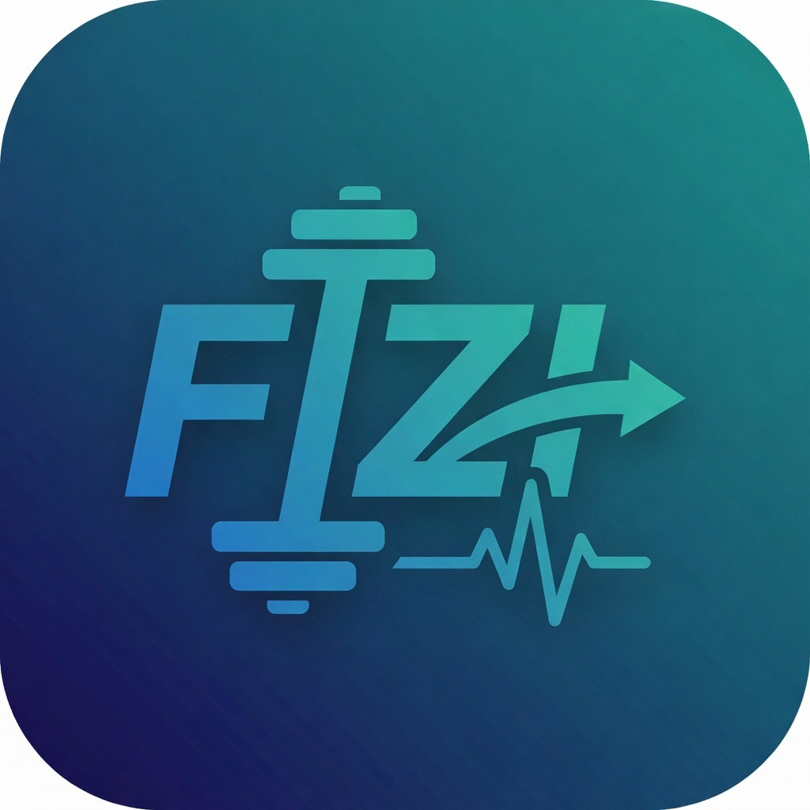

# 🤖 FIZI - AI Fitness Trainer

> **Your Personal AI-Powered Gym Companion**  
> *Real-time form correction, rep counting, and personalized workout plans.*



## 🚀 Overview
FIZI is a cutting-edge mobile fitness application built with **React Native (Expo)** and **Python (Flask + MediaPipe)**. It uses computer vision to analyze your exercise form in real-time, count repetitions accurately, and provide instant audio/haptic feedback—just like a real personal trainer.

## ✨ Key Features
- **🎥 Real-Time AI Form Analysis**: Detects body keypoints to ensure perfect form.
- **🔢 Intelligent Rep Counting**: Auto-counts reps with 99% accuracy (no false positives).
- **🗣️ Dynamic Audio Feedback**: "Lower your hips!", "Keep your back straight!"
- **📊 100% Exercise Coverage**: Validates form for **53+ exercises** (Squats, Pushups, Yoga, etc.).
- **🔐 Persistent Login**: Stay signed in securely with Firebase Auth & AsyncStorage.
- **☁️ Cloud-Powered**: Deep learning backend hosted on Render for lightweight app size (~35MB).
- **📈 Progress Tracking**: Visual history, level progression, and workout analytics.

---

## 🏗️ System Architecture

```mermaid
graph TD
    User[📱 Mobile App (React Native)] -->|Camera Feed (Base64)| CloudLB[☁️ Render Load Balancer]
    CloudLB -->|HTTPS POST| Backend[🐍 Python Backend (Flask)]
    
    subgraph "AI Inference Engine"
        Backend -->|Frame| MediaPipe[MediaPipe Pose]
        MediaPipe -->|Landmarks| AngleCalc[📐 Angle Calculator]
        AngleCalc -->|Angles| FormValid[✅ Form Validator]
        FormValid -->|Feedback| RepCounter[🔢 Rep Counter]
    end
    
    Backend -->|JSON Response| User
    
    subgraph "Data & Auth"
        User -->|Auth Token| Firebase[🔥 Firebase Auth]
        Firebase -->|Session| AsyncStore[💾 AsyncStorage]
        User -->|User Data| Firestore[☁️ Cloud Firestore]
    end
```

## 🛠️ Tech Stack

### **Frontend (Mobile App)**
- **Framework**: React Native (Expo SDK 50)
- **Language**: TypeScript
- **State Management**: Redux Toolkit
- **Navigation**: React Navigation v6
- **UI Components**: Custom Glassmorphism UI
- **Deployment**: Expo EAS (Android/iOS)

### **Backend (AI Server)**
- **Framework**: Python Flask
- **Vision Model**: Google MediaPipe Pose (BlazePose)
- **Server**: Gunicorn (Production WSGI)
- **Deployment**: Docker on Render.com
- **Optimization**: Headless OpenCV, Single-Worker State Management

---

## 🚀 Getting Started

### 1. Clone the Repository
```bash
git clone https://github.com/MaheshChalla2701/FIZI.git
cd FIZI
```

### 2. Install Dependencies
```bash
npm install
```

### 3. Run the App
```bash
npx expo start --go
```
*Scan the QR code with the Expo Go app on your Android/iOS device.*

---

## ☁️ Deployment

### Backend (Already Deployed)
The backend is live at: `https://fizi-backend.onrender.com`

**To Re-deploy:**
1. Push changes to `main` branch.
2. Render automatically triggers a new build via `render.yaml`.
3. Docker container rebuilds and deploys in ~5 minutes.

### Frontend (Play Store Build)
```bash
eas build --platform android --profile production
```

---

## 🧪 Validated Exercises (53 Total)
| Category | Examples |
|----------|----------|
| **Bodyweight** | Push-ups, Squats, Lunges, Plank, Glute Bridges |
| **Equipment** | Bench Press, Deadlift, Shoulder Press, Lat Pulldown |
| **Cardio** | Jumping Jacks, High Knees, Burpees, Jump Rope |
| **Yoga/Flex** | Downward Dog, Cobra, Child's Pose, Cat-Cow |

---

## 🤝 Contributing
1. Fork the Project
2. Create your Feature Branch (`git checkout -b feature/AmazingFeature`)
3. Commit your Changes (`git commit -m 'Add some AmazingFeature'`)
4. Push to the Branch (`git push origin feature/AmazingFeature`)
5. Open a Pull Request

---

## 📜 License
Distributed under the MIT License. See `LICENSE` for more information.

---

> **Built with ❤️ by Mahesh Challa**
